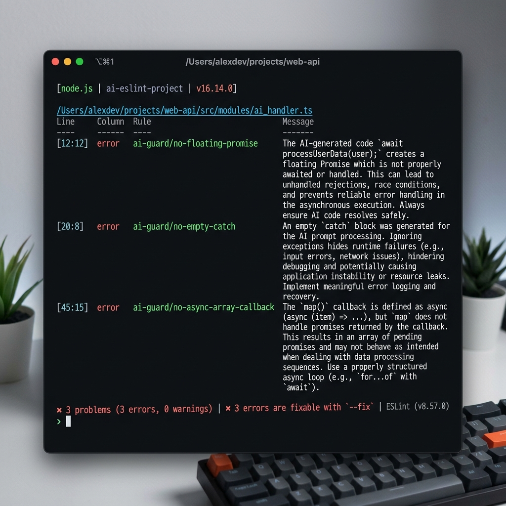

<p align="center">
  <h1 align="center">eslint-plugin-ai-guard</h1>
  <p align="center">
    <strong>🛡️ ESLint plugin that catches the code patterns AI tools get wrong most often.</strong>
  </p>
  <p align="center">
    <a href="https://www.npmjs.com/package/eslint-plugin-ai-guard"></a>
    <a href="https://github.com/YashJadhav21/eslint-plugin-ai-guard/actions"></a>
    <a href="https://www.npmjs.com/package/eslint-plugin-ai-guard"></a>
    <a href="https://github.com/YashJadhav21/eslint-plugin-ai-guard/blob/main/LICENSE"></a>
  </p>
</p>

---

AI-generated code has **1.7× more issues** and **2.74× more security vulnerabilities** than human code ([CodeRabbit 2025](https://www.coderabbit.ai/)). Existing linters catch human mistakes — `ai-guard` catches the patterns AI tools consistently get wrong: empty catch blocks, floating promises, async array misuse, and more.

## Install

```bash
npm install --save-dev eslint-plugin-ai-guard
```

## Quick Start

### ESLint 9 (Flat Config) — `eslint.config.js`

```js
import aiGuard from 'eslint-plugin-ai-guard';

export default [
  {
    plugins: { 'ai-guard': aiGuard },
    rules: {
      ...aiGuard.configs.recommended.rules,
    },
  },
];
```

### ESLint 8 (Legacy Config) — `.eslintrc.json`

```json
{
  "plugins": ["ai-guard"],
  "extends": ["plugin:ai-guard/recommended"]
}
```

That's it. **Zero configuration required.**

## 🎬 Real Workspace Demo

See how `ai-guard` catches a common AI-generated async bug that silent failures in production:

```typescript
// ❌ BAD: AI often forgets to await or wrap in Promise.all
const userIds = [1, 2, 3];
userIds.map(async (id) => {
  return await fetchUser(id);
}); 
// ⚠️ ai-guard flags: Async callback passed to Array.map(). Returns Promise[], not values.

// ✅ GOOD: ai-guard recommended fix
const users = await Promise.all(userIds.map(async (id) => {
  return await fetchUser(id);
}));
// ✨ ai-guard: No issues found.
```

### Terminal Output



*The terminal output above shows `ai-guard` catching multiple AI-generated anti-patterns in a single run.*

## Rules

| Rule | Category | Default | Description |
| --- | --- | --- | --- |
| [`no-empty-catch`](docs/rules/no-empty-catch.md) | Error Handling | `error` | Disallow empty catch blocks — AI tools silently swallow errors |
| [`no-async-array-callback`](docs/rules/no-async-array-callback.md) | Async | `error` | Disallow `async` callbacks in `map`/`filter`/`forEach`/`reduce` — returns `Promise[]`, not values |
| [`no-floating-promise`](docs/rules/no-floating-promise.md) | Async | `error` | Disallow calling async functions without `await` or `.catch()` — errors disappear silently |

### Configs

| Config | Description |
| --- | --- |
| `recommended` | Most impactful rules at `error` — works with zero configuration |
| `strict` | All rules at `error` — for teams that want maximum coverage |
| `security` | Security-focused rules only — for AppSec teams |

## Why This Exists

AI coding assistants generate code that **looks correct** but has subtle structural issues:

- 🕳️ **Empty catch blocks** — errors vanish silently
- ⏳ **`array.map(async ...)`** — returns `Promise[]`, not resolved values
- 🔥 **Floating promises** — `fetchData()` without `await` = silent failures

These patterns pass TypeScript and existing linters. `ai-guard` catches them.

## Supported Environments

- **ESLint** 8.x and 9.x (flat config)
- **Node.js** ≥ 18
- **TypeScript** and JavaScript

## Development

```bash
git clone https://github.com/YashJadhav21/eslint-plugin-ai-guard.git
cd eslint-plugin-ai-guard
npm install
npm run test        # Run test suite
npm run build       # Build CJS + ESM
npm run typecheck   # TypeScript check
```

## Contributing

Contributions are welcome! Please see [CONTRIBUTING.md](CONTRIBUTING.md) for guidelines.

**Rule requests:** Open an issue using the [Rule Request template](https://github.com/YashJadhav21/eslint-plugin-ai-guard/issues/new).

**False positive reports:** Open an issue using the [False Positive template](https://github.com/YashJadhav21/eslint-plugin-ai-guard/issues/new) — we take zero false positives seriously.

## License

[MIT](LICENSE) — free forever. No rules behind a paywall.

---

<p align="center">
  Built to make AI-assisted development safer. ⚡
</p>
